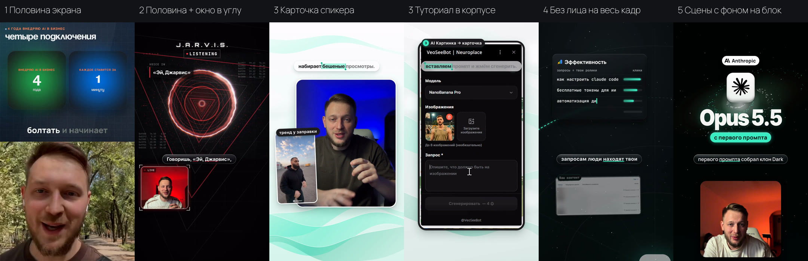

# Монтаж Reels ИИ-агентом на Remotion

Учебный репозиторий onAI Academy, модуль 1 «AI-монтаж» курса «Контент-завод на ИИ». Внутри рабочий движок и паттерны
роликов, которые монтирует ИИ-агент автора курса: форматы, стили, блоки движения, субтитры, звук, проверки кадров,
рендер, выкладка и выводы из статистики.



## Как начать

Отдайте агенту (Claude Code или Codex) ссылку и сообщение:

```text
Клонируй https://github.com/saint4ai/reels-montage-remotion-course.
Прочитай навык .claude/skills/onai-montage/SKILL.md и работай только по нему.
Проведи онбординг и интервью. Финал не рендери, пока я не одобрю кадры и черновик.
```

Агент сам ставит зависимости, проверяет компьютер, коротко объясняет, как устроен репозиторий, и ведёт по шагам
1.1–1.5. Подробно для ученика: [START-HERE.md](START-HERE.md).

## Как это устроено

```
запись → расшифровка по словам → карта монтажа → сборка (движок стилей или свой ролик по образцу)
      → проверка текста в контейнерах → кадры К001… каждые 2 с → черновик 720p → финал 2K/4K, −14 LUFS → выкладка
```

| Путь | Что там |
|---|---|
| `.claude/skills/onai-montage/` | навык агента: роль, онбординг, шаги 1.1–1.5, справочники, грабли |
| `src/styles`, `src/template` | движок стилей: PRISM, ORBIT, TRACE, PULSE, GLASS, PORTRAIT, APPLE, PODCAST, EXPERT |
| `src/reels/_template` | шаблон своего ролика: половина экрана + окно в углу |
| `src/kit` | блоки движения: переходы, фоны, HUD и реактор, стекло, постер, 3D-предметы, эффекты текста |
| `patterns/` | каталог паттернов и код рабочих роликов с картами монтажа (`patterns/reels/r19…r29`) |
| `templates/` | бриф, карта монтажа, пакет на выкладку |
| `public/` | шрифты, звуки, настоящие логотипы, 3D-предметы, доски форматов и стилей |

## Команды

```bash
npm install
npm run doctor
npm run studio
npm run new -- <slug> <СТИЛЬ|custom>
npm run frames -- <композиция>
npm run draft -- <композиция>
npm run render -- <композиция>
```

## Версии

- **2.0 (26.09.2026)**: движок и паттерны рабочих роликов 19–29, навык `onai-montage`, кадр 1440×2560, 60 fps.
- 1.0 (22.09.2026): учебный макет с восемью стилями. Его картинки и PDF-гайд лежат в `public/style-previews/v1`
  и `output/pdf` и описывают старую версию.

Шрифт SF Pro в репозиторий не входит: его имя привязано к свободному Inter Tight.
