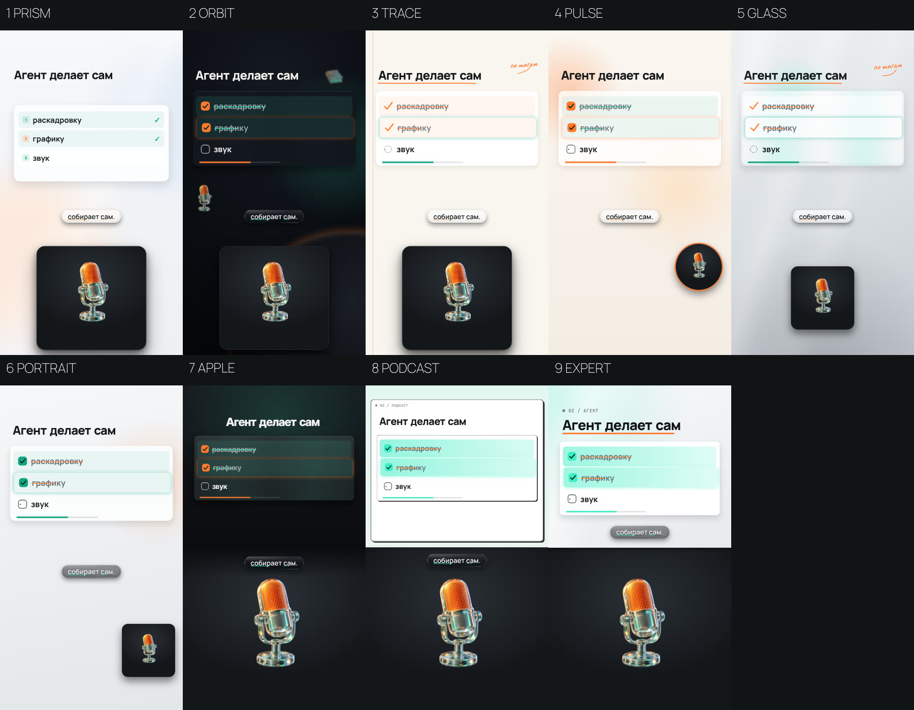

# Начните здесь

## 1. Что подготовить

- Запись на телефон (с лицом) или только голос. Можно без записи: агент сначала напишет текст.
- Тема и одно действие зрителя после просмотра.
- 2–5 роликов-референсов и что в них нравится.
- Логотип и цвета, если есть. Скриншоты или ссылка на продукт, о котором ролик.

## 2. Первое сообщение агенту

```text
Клонируй https://github.com/saint4ai/reels-montage-remotion-course.
Прочитай навык .claude/skills/onai-montage/SKILL.md и работай только по нему.
Проведи онбординг и интервью. Финал не рендери, пока я не одобрю кадры и черновик.
```

Агент поставит всё сам. В терминал вам ничего вводить не нужно: только разрешать агенту действия.

## 3. Как идёт работа (шаги курса)

| Шаг | Что делает агент | Что делаете вы |
|---|---|---|
| 1.1 Рабочее место | ставит зависимости, проверяет компьютер, показывает студию и пробный лист кадров | смотрите, что всё запустилось |
| 1.2 Идея и сценарий | задаёт вопросы, пишет текст по закону хука, первые 3 с: огромная фраза-обещание | утверждаете текст, записываете видео или голос |
| 1.3 Формат и стиль | показывает доски форматов и стилей, советует один | выбираете |
| 1.4 Сборка | расшифровка, карта монтажа, сборка, проверки, кадры К001… | правки по номерам кадров, «ок» по кадрам и черновику |
| 1.5 Серия и выкладка | пакет на выкладку, подпись, директ, замер статистики | публикуете сами |




## 4. Как давать правки

Правки по номерам кадров из листа:

```text
К003: заголовок мельче, лицо обрезано по голове.
К006: вместо иконки настоящий скриншот сервиса.
К009: субтитры легли на лицо.
```

Агент исправит и покажет новую версию листа. Финальный рендер только после вашего «ок» по кадрам и черновику 720p.

## 5. Результат

Финал в 2K (1440×2560, 60 кадров в секунду), 4K по просьбе. Громкость выровнена. Рядом пакет на выкладку: подпись,
текст для директа, ответы на частые вопросы, заголовок для YouTube.
