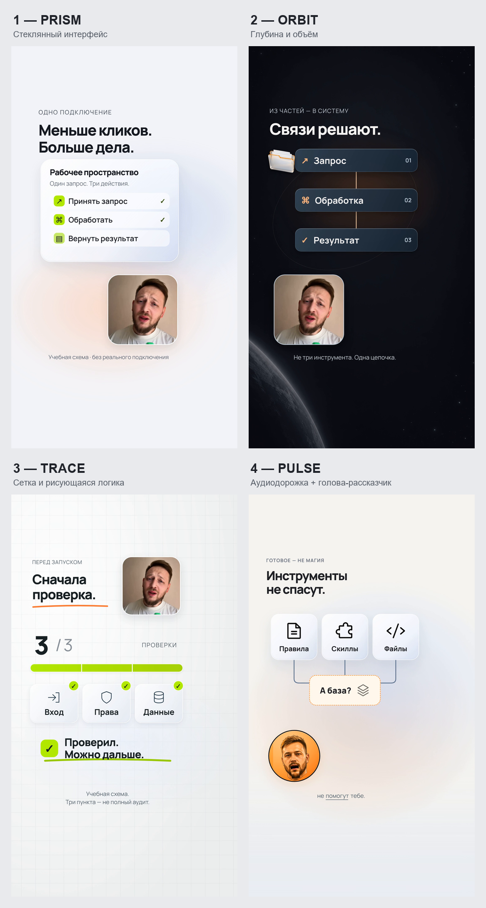

# Начните здесь

## 1. Что подготовить

Минимум: исходное видео или аудио, тема ролика и желаемая площадка. Для точного результата добавьте 2-5 референсов, логотип и фирменные цвета.

Подойдут:

- разговорное видео, подкаст или интервью;
- длинное YouTube-видео, из которого нужно выбрать сильный фрагмент;
- готовый текст и озвучка;
- запись экрана с объяснением продукта;
- набор скриншотов для ролика без спикера.

## 2. Первое сообщение агенту

```text
Клонируй https://github.com/saint4ai/reels-montage-remotion-course.
Прочитай AGENTS.md и проведи меня по процессу.
Сначала задай вопросы и покажи четыре стиля.
Не собирай финальный MP4 до моего одобрения кадров.
```

После клонирования агент обязан задать один компактный блок вопросов. Ответьте обычным сообщением, без специальных терминов.

## 3. Выберите стиль



1. **PRISM**: светлый стеклянный интерфейс. Подходит для сервисов, автоматизаций и продукта.
2. **ORBIT**: глубина, объекты и связи. Подходит для систем, процессов и технологичных тем.
3. **TRACE**: сетка и рисующаяся логика. Подходит для обучения, чеклистов и разборов.
4. **PULSE**: голос и крупные предметы. Экспериментальный формат для энергичного рассказчика.

## 4. Дождитесь плана

До сборки агент покажет:

- короткий бриф;
- выбранную тему и центральную мысль;
- сценарий по смысловым блокам;
- план визуальных сцен;
- список недостающих материалов.

Исправьте смысл на этом этапе. Это быстрее, чем переделывать уже собранную анимацию.

## 5. Согласуйте кадры

Агент создаёт статичные кадры на 0, 2, 4, 6 секундах и в конце ролика. Давайте правки по номеру:

```text
К003: заголовок слишком мелкий. Увеличь и оставь больше воздуха.
К006: замени абстрактную иконку на узнаваемый скриншот сервиса.
К009: лицо перекрывает подпись. Перенеси портрет левее.
```

После исправлений агент показывает обновлённые кадры. Только затем запускается финальный рендер.

## 6. Заберите результат

Финальный файл появляется в `out/reel.mp4`. Вместе с ним агент сохраняет краткий отчёт: длительность, разрешение, выбранный стиль, использованные источники и результаты проверки.

