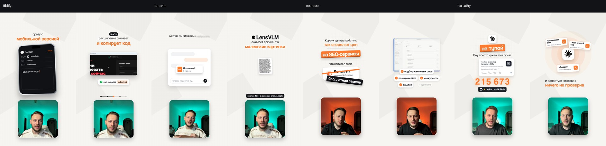

# 15 — ЛИСТ (белый редакционный лист)

**Статус:** утверждён автором курса 27.09.2026 на ролике Tildify («это просто охуенно… сохрани как новый стиль»),
на нём же сданы Apple LensVLM, OpenSEO и «Правила Карпатого» (27–29.09.2026, 4K).
**Код:** `patterns/styles/sheet/code/` (четыре ролика лежат рядом, импорты между ними работают как в студии автора).
**Образцы с кадрами:** `patterns/reels/sheet-tildify`, `sheet-lensvlm`, `sheet-openseo`, `sheet-karpathy`.
**Доска стиля для выбора:** `public/style-previews/sheet.jpg`.

## Механика

- **Лист, а не сцены.** Тёплый белый `#F6F5F1` или чёрный `#0E0F11`, других фонов нет. Сетка 48–64 px видна пятном вокруг
  текста (радиальная маска), по углам две бледные косые плоскости. Меняются предметы на листе, а не фон.
- **Пара шрифтов:** фраза SF Pro Display (300/400/600), одно слово-акцент **Coolvetica** оранжевым `#FF7A2F`. Слово проявляется
  из размытия и подъёма ровно на своём слове речи (`Word` по пословной расшифровке).
- **Текстовый блок одной колонкой по центру** с ровным ритмом: малая строка SF 54 → цветная строка SF 600 84 оранжевым →
  черта 560 px, которая дорисовывается → плашка (`Block` в `seo/SeoDemo.tsx`). Строки разного размера вразнобой автор назвал «ломано».
- **Плашка:** главное слово белым Coolvetica на оранжевом, наклон −2…−3°, пружина масштаба и поворота, нижняя грань и тень
  («за 5 шагов», «не цена», «4 правила»). Вариант: тёмная плашка для названия продукта, белая с логотипом («#1 Product of the Day»).
- **Стрелка-маркер:** жирный рукописный штрих 16 px рисуется за 0,3 с к цели, наконечник раскрывается в конце; указывает на смысл.
- **Стикер «шлёп»:** надпись под наклоном падает сверху с масштаба 1,6 на предмет («бесплатная замена», «живые данные»).
- **Одометр:** число из речи крутится барабанами, каждый разряд отдельно, младшие со смазом, в конце загорается оранжевым
  (`Odometer`, `Odo`). Под ним кнопка источника (★ звёзд на GitHub).
- **Настоящий продукт крупно:** запись экрана или официальное демо в окне на всю ширину 864 px, камера кадрирует и подъезжает
  к действию; рисунки из статьи, карточка репозитория GitHub, настоящие логотипы.
- **Приём «как Tasks»:** иконка или фигура в трёх бледных кругах, вокруг по одной на каждую фразу всплывают карточки
  (заголовок, подпись, значок справа), внизу подпись с выключкой влево.
- **Телефон под наклоном:** в поле печатается фраза речи, лишнее выделяется и стирается внутри телефона.
- **Шаги:** чёрная плашка «ШАГ n», строка + акцент, внизу полоска прогресса из пяти узлов.
- **Призыв:** поле комментария, печатается кодовое слово из записи, отправка, «ссылка → Claude → ✓ сам всё поставит»,
  затемнение в чёрный.
- **Сцены длинные, 4–8 с.** Внутри сцены лист не меняется: блок заголовка уменьшается (×0,78–0,92) и остаётся якорем, снизу
  выходит новый предмет. Смена сцены: старая уходит в размытие 16 px, новая проявляется из него; внутри сцены наезд 1 → 1,035.

## Раскладка (кадр 1440×2560, 4K рендерится с `--scale=1.5`)

- Всё по центру x = 720; смысловая зона x 288–1152 (справа рейка Instagram), текст не выше y 359.
- Спикер: карточка 760×720, радиус 60, **нижний край y 2350**. Графика кончается до y ≈ 1600 и не касается карточки.
- Заголовочный блок начинается на y ≈ 460–520; когда остаётся якорем, почти не поднимается.
- Акцент на плашке 100–160 px, иконки сервисов 170–240 px, окна записей 864 px, чипы от 48 px, **текст не меньше 40 px**.
  Мелких серых абзацев нет: при быстрой речи их не успевают прочитать.
- Любую фразу мерить по ширине до показа (`PIL ImageFont.truetype(...).getlength`), не шире ~820 px, длинную делить на две строки.

## Тайминг

- **Всё в сцене появляется полностью до смены кадра.** Сцена не короче ~1,8 с; короче: склеить с соседней.
- Фраза кончается у самой смены → смену позже на 0,1–0,25 с, появление элемента на слово раньше.
- Плашку к числу выпускать сразу, как счётчик доехал. Печать и выделение быстрее речи. Стрелка сразу за плашкой.

## Звук

Пак «UI sound 1 | isla.creator»: нарезки `public/sfx/isla/*.wav`, тайминги (onset, peak, dur) `code/doc/data/isla-sfx.json`.
Свист `sw-s*` пиком на стык, `pop`/`popup` на появление и плашку, `click`/`click4` на касание и появление карточки, `select`
на выделение, `count` на счётчик, `chime` на выгоду, `confirm` на «готово», `notif` на уведомление, `es-open` на выезд окна,
`type-a`/`type-b` на печать (обрезать по длине текста), `hit2`/`crispy` на стикер и перечёркивание. Громкость 0,2–0,4.
В печати без «дзинь». После рендера мастеринг до −14 LUFS, пик ≤ −1 dBTP (`npm run master`).

## Как устроен код (`code/`)

| Файл | Что в нём |
|---|---|
| `tildify/TildifyDemo.tsx` | общие детали: `Word`, `Plate`, `Pointer`, `Logo`, `Row`, `typed`, `k`, `spr`, таблица звуков `ISLA`; сцены 1–4 Tildify |
| `tildify/TildifyReel.tsx` | окно записи экрана с камерой, шаги с прогрессом, весь ролик Tildify |
| `seo/SeoDemo.tsx` | `Sheet` (белый/чёрный лист), `GridPatch`, `Block`, `PlateIn`, `Odometer`; сцены 1–3 OpenSEO |
| `seo/SeoReel.tsx` | окно демо с кадрированием, чипы с галочкой, карточки цен, призыв |
| `lens/LensDemo.tsx`, `lens/LensReel.tsx` | токены 10 → 2, карточка Hugging Face, файл в чате, строка договора, страницы из статьи, телефон с ботом |
| `karp/KarpDemo.tsx`, `karp/KarpReel.tsx` | `Odo` на любое число разрядов, приём «как Tasks», список из 4 правил, файл 800 → 70 строк |
| `*/data/*-words.json` | пословные расшифровки (whisper medium) |

Каждый ролик собран из двух файлов: `<Id>Demo.tsx` (пример на 10–13 с, который автор смотрел первым) и `<Id>Reel.tsx`
(весь ролик, берёт сцены примера). Записи спикера и видео сервисов в репозиторий не входят: код ссылается на
`public/<ролик>/*.mp4`. Чтобы запустить образец, положи свою запись и поправь пути; для нового ролика скопируй ближайший
образец в `src/reels/<slug>/` и зарегистрируй композицию 1440×2560, 60 fps.

## Порядок работы на ролик

1. Запись → пословная расшифровка; спорные слова и цифры перепроверить отрывком и по первоисточнику.
2. Пример на 10–13 с (конец фразы, а не ровно 10 с) → черновик 720p → «ок» владельца.
3. Весь ролик → 720p → правки по скриншотам → финал 2K или 4K, мастеринг.
4. Перед каждым показом: кадр за 0,08 с до **каждой** смены сцены (всё уже на экране) и лист кадров каждые 0,25–0,5 с
   с линиями x 288/1152, y 359 и y 1630 (верх карточки спикера).

## Когда брать

Инструкция к сервису или расширению, «как за N шагов», обзор продукта или модели с настоящим интерфейсом, цифрами и ценами.

## Что автор принимал и отклонял

- Принято: пара Coolvetica + SF Pro, плашка с пружиной, телефон с печатью и стиранием, настоящие записи экрана по шагам,
  одометр до точной цифры, «как Tasks», длинные сцены с якорем, только белый и чёрный лист.
- Отклонено: стрелки-клинья из углов («ломанная анимация»); зачёркивание рядом с телефоном; медленная печать и выделение;
  разноцветные листы на каждый блок («слишком много разных фонов»); мелкий абзац под плашкой; текст разного размера вразнобой;
  заголовок, прижатый к верху кадра; окно видео, наезжающее на карточку спикера; элементы, не успевающие до смены кадра;
  «плюхи» на появлении карточек (заменены кликами).

## Шрифты в курсе

Всё, на чём собран стиль, лежит в `public/fonts` и подключено в `src/fonts.ts`: SF Pro Display (Light, Regular, Medium,
Semibold, Bold, Heavy, Black и курсивы), SF Pro Text, SF Mono и Coolvetica. Код образцов работает без правок и выглядит
как у автора.
